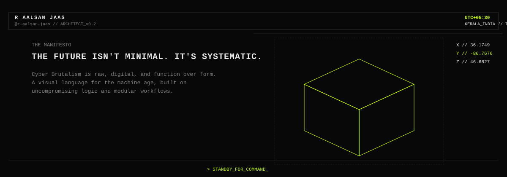
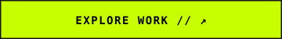
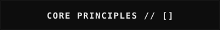
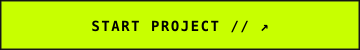

<!-- CYBER BRUTALIST TOP HUD -->

  

<!-- SEAMLESS CLICKABLE NAVIGATION GRID -->

  
  
  

 

<!-- ==================== /02 CORE PRINCIPLES ==================== -->

  

 

<!-- ==================== /03 SELECTED WORK ==================== -->

  

 

<!-- ==================== /04, /05, /06 & FOOTER DECK ==================== -->

  

