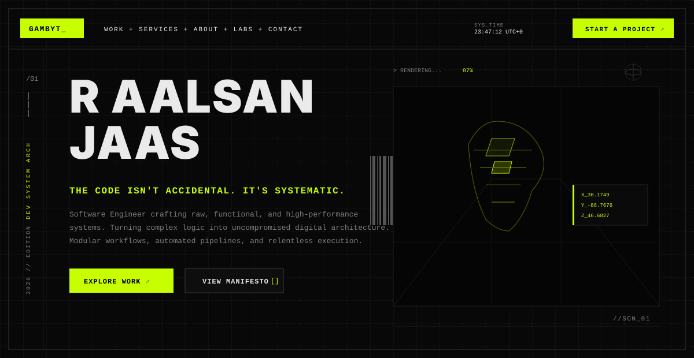
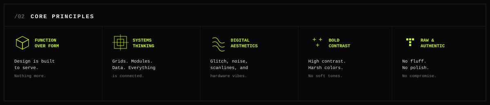
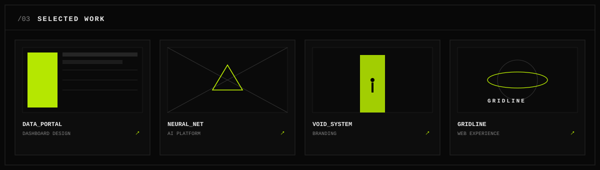
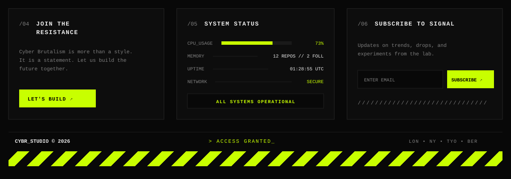

  

`// NAV_DOCK: ACTIVE` &nbsp;&nbsp;&nbsp;  &nbsp;&nbsp;  &nbsp;&nbsp; 

 

<!-- ==================== /02 CORE PRINCIPLES ==================== -->

  

 

<!-- ==================== /03 SELECTED WORK ==================== -->

  

 

<!-- ==================== /04, /05, /06 & FOOTER DECK ==================== -->

  

