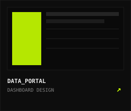
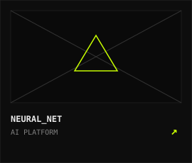
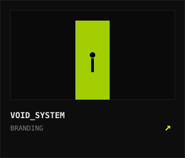
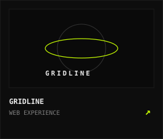

<div align="center">
  <a href="https://github.com/r-aalsan-jaas">
    
  </a>
</div>

<div align="center">

`// NAV_DOCK: ACTIVE` &nbsp;&nbsp;&nbsp; [](#03-selected-work) &nbsp;&nbsp; [](#02-core-principles) &nbsp;&nbsp; [](mailto:your-email@example.com)

</div>

<br/>

<!-- ==================== /02 CORE PRINCIPLES ==================== -->
<a name="02-core-principles"></a>
<div align="center">
  
</div>

<br/>

<!-- ==================== /03 SELECTED WORK ==================== -->
<a name="03-selected-work"></a>
### `/03` SELECTED WORK

| [](https://github.com/r-aalsan-jaas/canteen-management) | [](https://github.com/r-aalsan-jaas/Make-Up-a-Letter) | [](https://github.com/r-aalsan-jaas) | [](https://github.com/r-aalsan-jaas) |
| :---: | :---: | :---: | :---: |

---

<!-- ==================== /04, /05, /06 TERMINAL DECK ==================== -->

| `[04]` **JOIN THE RESISTANCE** | `[05]` **SYSTEM STATUS** | `[06]` **SUBSCRIBE TO SIGNAL** |
| :--- | :---: | :--- |
| Cyber Brutalism is raw, digital, and functional.<br/>A new visual language for the machine age.<br/><br/>Let us build the future together.<br/><br/>[](mailto:your-email@example.com) | [](https://github.com/r-aalsan-jaas)<br/><br/>`[ ALL SYSTEMS OPERATIONAL ]` | Updates on trends, drops, architecture, and telemetry experiments.<br/><br/>Directly from the lab terminal.<br/><br/>[](https://github.com/r-aalsan-jaas?tab=followers) |

<br/>

<!-- ==================== FOOTER ==================== -->
```text
////////////////////////////////////////////////////////////////////////////////////////////////////
//  CYBR_STUDIO © 2026           |  STATUS: ACCESS GRANTED_          |  NODE: LON • NY • TYO • BER//
////////////////////////////////////////////////////////////////////////////////////////////////////
